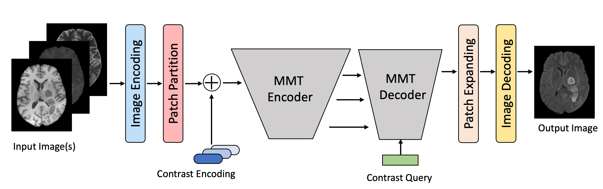

# Multi-contrast multi-scale vision transformer (MMT)

## Usage

### 1. Prepare data

Please go to ["./datasets/README.md"](datasets/README.md) for details.

### 2. Environment

The conda environment is specified in ['mmt_env.yml'](mmt_env.yml). The environment can be installed by:

```bash
conda env create --file mmt_env.yml
```
Make sure to change `Prefix` in the yml file to your own conda path.
### 3. Train

Train MMT-random model:

```bash
CUDA_VISIBLE_DEVICES=0 python train.py --batch_size 32 --n_gpu 1 --optimizer adamw --exp MMT_random --lambda_self 5 --lambda_cross 20 --lambda_triplet 0 --lambda_GAN 0.1 --max_epochs 75 --warmup_epoch 5 --label_smoothing
```
Train MMT-single model:

```bash
CUDA_VISIBLE_DEVICES=0 python train.py --batch_size 32 --n_gpu 1 --optimizer adamw --exp MMT_single --lambda_self 5 --lambda_cross 20 --lambda_triplet 0 --lambda_GAN 0.1 --max_epochs 50 --warmup_epoch 3 --label_smoothing --k 3
```
Train MMT-zerogad model:
```bash
CUDA_VISIBLE_DEVICES=0 python train.py --batch_size 32 --n_gpu 1 --optimizer adamw --exp MMT_zerogad --lambda_self 5 --lambda_cross 20 --lambda_triplet 0 --lambda_GAN 0.1 --max_epochs 50 --warmup_epoch 3 --label_smoothing --zero_gad
```
### 4. Test
Test MMT models:
```bash
CUDA_VISIBLE_DEVICES=0 python test.py --batch_size 32 --n_gpu 1 --ckpt CKPT_NAME --model_path MODEL_PATH --vis_dir TEST_DIR --vis
```
where `CKPT_NAME` is the checkpoint file to use, e.g. `epoch_49.pth`, and `MODEL_PATH` is the directory of the model, e.g.,`model/MMT_random`. The test results will be saved to `TEST_DIR`, and `--vis` specifies whether to visualize the results.
Make sure to use `--k` or `--zero_gad` to specify the input combination (default is `k=None` and the model will be tested on all input combinations).

### 5. Compute Attention Scores
MMT-single:
```bash
python compute_attn_score.py --model_path /mnt/raid/jiang/projects/SubtleGAN/model/MMT/MMTUNetHybrid_GAN_s_c_MMT_epo50_bs24_lrg0.0005_192_opt-adamw/ --ckpt epoch_49.pth --head_norm --k 3
```
MMT-random:
```bash
python compute_attn_score.py --model_path /mnt/raid/jiang/projects/SubtleGAN/model_fluidstack/MMT/MMTUNetHybrid_GAN_ls_random_s_c_MMT_epo75_bs32_lrg0.0005_192_opt-adamw/ --ckpt epoch_74.pth --head_norm --k 3
```
MMT-zerogad:
```bash
python compute_attn_score.py --model_path /mnt/raid/jiang/projects/SubtleGAN/model_fluidstack/MMT/MMTUNetHybrid_GAN_ls_zerogad_s_c_MMT_epo50_bs32_lrg0.0005_192_opt-adamw --ckpt epoch_31.pth --head_norm --zero_gad
```

## Trained models
### MMT models
* Random:
`/mnt/raid/jiang/projects/SubtleGAN/MMTUNetHybrid/model/fluidstack_models/finetuned_models/MMT_random_0202_epo100_bs32_lrg0.0005_5.0_20.0_0.0_0.1/best_mae.pth` (BraTS)
`/mnt/raid/jiang/projects/SubtleGAN/MMTUNetHybrid/model/IXI_random_new_epo100_bs20_lrg0.0005_5.0_20.0_0.0_0.1/best_mae.pth` (IXI)
* Single:
`/mnt/raid/jiang/projects/SubtleGAN/MMTUNetHybrid/model/IXI_random_new_epo100_bs20_lrg0.0005_5.0_20.0_0.0_0.1/best_mae.pth` (BraTS)
  `/mnt/raid/jiang/projects/SubtleGAN/MMTUNetHybrid/model/IXI_single_0217_epo100_bs20_lrg0.0005_5.0_20.0_0.0_0.1/best_mae.pth` (IXI)
* Zerogad:
`/mnt/datasets/jiang/projects/SubtleGAN/model_fluidstack/MMT/MMTUNetHybrid_GAN_ls_zerogad_s_c_MMT_epo50_bs32_lrg0.0005_192_opt-adamw/epoch_31.pth`
* Zerogad Stanford (No VGG loss):
`/home/srivathsa/projects/SubtleGad/train/prototypes/mmt/MMTUNetHybrid/model/MMT_zerogad_sford_epo200_bs32_lrg0.0005_5.0_20.0_0.0_0.1/epoch_198.pth`
### MILR models
* Random:
`/mnt/datasets/jiang/projects/SubtleGAN/model/MMT/MMTBaseline_agis_random_MMT_epo100_bs16_lrg0.0001_192/epoch_99.pth` (BraTS)
  `/mnt/raid/jiang/projects/SubtleGAN/MMT/model/MMT/IXI_Baseline_agis_random_MMT_epo100_bs16_lrg0.0001_192/epoch_99.pth` (IXI)
* Single:
  `/mnt/datasets/jiang/projects/SubtleGAN/model/MMT/MMTBaseline_agis_MMT_epo100_bs16_lrg0.0001_192/epoch_99.pth` (BraTS)
  `/mnt/raid/jiang/projects/SubtleGAN/MMT/model/MMT/IXI_Baseline_agis_single_MMT_epo100_bs16_lrg0.0001_192/epoch_99.pth` (IXI)
* Zerogad:
`/mnt/datasets/jiang/projects/SubtleGAN/model/MMT/MMTBaseline_agis_zerogad_MMT_epo100_bs16_lrg0.0001_192/epoch_49.pth`
### MMGAN models
* Random:
  `/mnt/raid/jiang/projects/SubtleGAN/MMT/model/MMGAN/mmgan_brats_zeros_cl_random_0110/generator_param_mmgan_brats_zeros_cl_random_0110_60.pkl` (BraTS)
  `/mnt/raid/jiang/projects/SubtleGAN/MMT/model/MMGAN/mmgan_ixi_random_0118/generator_param_mmgan_ixi_random_0118_60.pkl` (IXI)
* Single:
  `/mnt/raid/jiang/projects/SubtleGAN/MMT/model/MMGAN/mmgan_brats_zeros_cl_single_0110/generator_param_mmgan_brats_zeros_cl_single_0110_60.pkl` (BraTS)
  `/mnt/raid/jiang/projects/SubtleGAN/MMT/model/MMGAN/mmgan_ixi_single_0118/generator_param_mmgan_ixi_single_0118_60.pkl` (IXI)
## Reference
* [TransUNet](https://github.com/Beckschen/TransUNet)
* [Swin Transformer](https://github.com/google-research/vision_transformer)
* [Swin UNet](https://github.com/microsoft/Swin-Transformer)
* [MUNIT](https://github.com/NVlabs/MUNIT)
